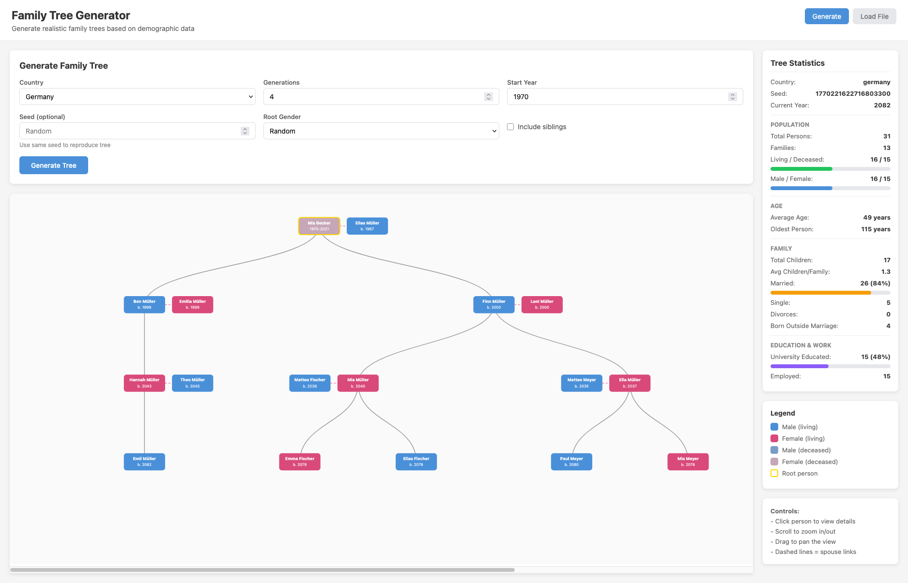

# Family Tree Generator

Generate realistic family trees using demographic, economic, and health data, with a web visualization UI and a JSON API.



**Highlights**
1. Deterministic generation using a seed
2. Family relationships (parents, spouses, siblings, children)
3. Demographic realism driven by country data
4. Web visualization with detailed person profiles
5. Docker support for the API server

**Project Layout**
1. `cmd/familytree` CLI generator
2. `cmd/server` HTTP API server
3. `web` React + Vite UI
4. `data` demographic and name datasets
5. `assets/screenshot.png` UI screenshot

**Quick Start (API Server)**
```bash
go run ./cmd/server
```

The server listens on `:8080` and exposes:
1. `GET /api/health`
2. `GET /api/countries`
3. `GET /api/country/{slug}`
4. `POST /api/generate`

**Default Generation Settings**
1. Country: `germany`
2. Start year: `1970`
3. Generations: `3`

You can override these via the API request body or CLI flags.

**Run with Docker**
```bash
docker compose up --build
```

This builds the server image and runs it on port `8080`.

**Web UI**
```bash
cd web
npm install
npm run dev
```

The UI expects the API at `http://localhost:8080`. To change it, set `VITE_API_URL` in `web/.env`.

**CLI Usage**
```bash
go run ./cmd/familytree -country germany -generations 3 -start-year 1970 -format json -output tree.json
```

The visualization JSON will be written to `tree_viz.json` when using the CLI output helper.
